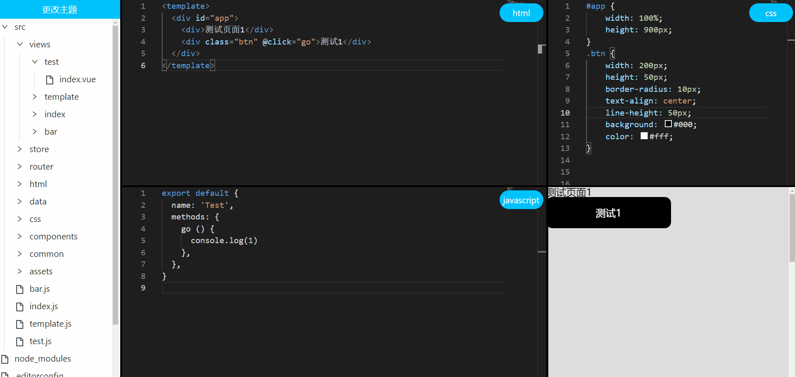

# umi project

## 线上webIde

Install dependencies,

```bash
$ yarn
```

Start the dev server,

```bash
$ yarn start
```
中台代码git地址
```bash
git clone https://github.com/xzhbbc/webside-service.git
```
其中在中台代码的根目录是有一个project文件，里面放的是vue的脚手架项目，我这里用的是公司的脚手架，就不方便放出来用了。
要想使用，可以自行在project文件下，创建前端项目。


